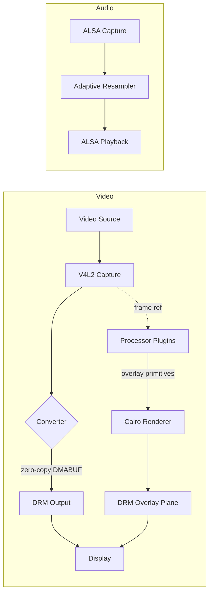

# OverlAIer

Real-time audio/video overlay processing pipeline. Captures video via V4L2, processes it through pluggable analyzers that produce overlay primitives, and outputs the composited result via DRM/KMS. Works on any Linux system with V4L2 capture and DRM output. Optional Rockchip RGA hardware acceleration when available.

## Build

- **Build system**: CMake (minimum 3.25), C23 standard
- **Target platform**: Linux (tested on Rock 5B Plus / RK3588, works on any V4L2+DRM system)
- **Native build**: `mkdir build && cd build && cmake .. && cmake --build . --target deploy`
- **Docker build**: `docker buildx build --target artifacts --output type=local,dest=./dist .`
- **CI**: GitHub Actions on native aarch64 runner (`ubuntu-24.04-arm`)
- **Dependencies**: ALSA, libdrm, libyuv, libsamplerate, librga (optional), cairo, pangocairo, libdisplay-info, zf_log (fetched via CMake)
- **Linting**: clang-tidy runs automatically during build; `cmake --build build --target format` to auto-format

The `deploy` target builds the pipeline executable and all processor plugins, copying them to `build/` at the project root:

```
build/
├── overlAIer
└── processors/
    └── fps_counter.so
```

## Project Structure

```
overlaier/
├── CMakeLists.txt                # Top-level, includes pipeline/ and processors/
├── Dockerfile                    # aarch64 build container (Debian trixie)
├── .github/workflows/build.yml   # CI pipeline
├── .clang-format                 # Code style config
├── .clang-tidy                   # Static analysis config
├── pipeline/                     # Core A/V pipeline
│   ├── CMakeLists.txt
│   ├── main.c                    # CLI, commands (run/query), pipeline orchestration
│   ├── common/
│   │   ├── pixfmt.c/h            # Internal pixel format enum + V4L2/DRM/RGA/libyuv mapping
│   │   ├── edid.c/h              # EDID read/generate/write for HDMI passthrough
│   │   └── log.h                 # Logging (zf_log wrapper)
│   ├── receiver/
│   │   ├── v4l2_caps.c/h         # V4L2 device capability query
│   │   ├── v4l2_capture.c/h      # V4L2 streaming capture with DMABUF export
│   │   ├── alsa_caps.c/h         # ALSA device capability query + auto-detection
│   │   ├── alsa_capture.c/h      # ALSA PCM capture with auto-reopen on signal loss
│   │   └── receiver.c/h          # Combined receiver query
│   ├── encoder/
│   │   ├── drm_caps.c/h          # DRM/KMS capability query (connectors, planes, modes)
│   │   ├── drm_output.c/h        # DRM atomic page-flip output with overlay plane
│   │   └── alsa_playback.c/h     # ALSA PCM playback
│   ├── converter/
│   │   ├── converter.c/h         # Backend dispatcher + DMA buffer management
│   │   ├── converter_sw.c/h      # Software conversion via libyuv (NV24->RGB, RGB<->RGB)
│   │   └── converter_rga.c/h     # RGA2/RGA3 hardware conversion via librga (YUV<->RGB)
│   ├── overlay/
│   │   └── overlay.c/h           # Cairo + Pango overlay renderer with primitive DSL
│   └── processor/
│       ├── processor.h            # Processor plugin interface
│       └── processor_mgr.c/h     # Plugin loader, per-processor threads, compositor
└── processors/                   # Processor plugins (built as .so)
    └── fps_counter/
        ├── fps_counter.c
        └── fps_counter.h
```

## Architecture



Converter is inserted only when V4L2 and DRM formats don't match. Processors run in separate threads and never block the video path.

### EDID Management (`pipeline/common/edid.c`)

On startup, the pipeline:
1. Reads the output monitor's EDID via DRM
2. Generates a passthrough EDID advertising the requested resolution/fps
3. Uses CVT-RBv2 (via libdisplay-info) for timing computation
4. Includes HF-VSDB for HDMI 2.0 pixel clocks > 340 MHz
5. Writes the EDID to the V4L2 capture device, triggering HPD on the source

### Receiver (`pipeline/receiver/`)

- **V4L2**: DV timings auto-detection, DMABUF export, signal loss detection via dequeue timeout
- **ALSA**: Adaptive resampling via libsamplerate with PI controller for clock drift compensation
- Auto-detects HDMI input devices; handles signal changes with full teardown/reinit

### Encoder/Output (`pipeline/encoder/`)

- **DRM/KMS**: Atomic modesetting, non-blocking page flips with flip tracking
- **Dual-plane compositing**: Video on primary plane, overlay on separate ARGB8888 plane
- **Triple buffering**: 3 V4L2 buffers with max 1 pending flip for stall-free 120Hz capture

### Processors (`processors/`)

Pluggable `.so` plugins loaded at runtime via `dlopen`. Each processor:
- Runs in its own thread with a frame mailbox (non-blocking delivery)
- Receives video frames and emits overlay primitives (normalized [0,1] coordinates)
- Never blocks the video pipeline

```c
struct ovl_processor_def {
    const char *name;
    struct { enum ovl_pixfmt format; uint32_t width, height; int max_fps; } input;
    void *(*init)(const struct ovl_processor_def *, uint32_t w, uint32_t h, enum ovl_pixfmt fmt);
    void (*process)(void *state, const void *frame, uint32_t w, uint32_t h, uint32_t stride,
                    struct ovl_primitive **prims_out, int *count_out);
    void (*destroy)(void *state);
};
```

Plugin search order: `<executable_dir>/processors/`, `./processors/`, `/usr/lib/overlaier/processors/`.

### Overlay System (`pipeline/overlay/`)

Primitive types: RECT, CIRCLE, ELLIPSE, LINE, POLYLINE, POLYGON, ARC, BEZIER, TEXT, IMAGE.

All coordinates normalized [0.0, 1.0] relative to frame dimensions. Font sizes relative to frame height. Rendered via Cairo + Pango to an ARGB8888 DRM overlay plane.

### Converters (`pipeline/converter/`)

- **Software** (libyuv): NV24->RGB, RGB<->RGB conversions with NEON optimization
- **RGA hardware** (librga): YUV<->RGB CSC via RGA2/RGA3 (zero CPU cost)
- Backend selected automatically; RGA only used for cross-colorspace conversions

### Format System (`pipeline/common/pixfmt.h`)

Canonical `enum ovl_pixfmt` with bidirectional mapping to V4L2, DRM, RGA, and libyuv format codes. Names describe memory byte order (like DRM, not V4L2).

## CLI

```
overlAIer [command] [options]

Commands:
  run          Start the overlay pipeline (default)
  query        Query device capabilities

Device options:
  --video-in,  -i DEV       V4L2 capture device  (default: first HDMI RX)
  --video-out, -o DEV[:CON] DRM device[:connector] (e.g. /dev/dri/card0:HDMI-A-2)
  --audio-in,  -a DEV       ALSA capture device   (default: HDMI input)
  --audio-out, -A DEV       ALSA playback device  (default: HDMI output)

Format options (run):
  --fmt                     Set format for both input and output
  --res            WxH      Set resolution for both input and output
  --fps            FPS      Set framerate for both input and output
  --fmt-in,    -f FOURCC    Force V4L2 input format (e.g. NV24, BGR3)
  --fmt-out,   -F FOURCC    Force DRM output format (e.g. BG24, NV24)
  --res-in,    -r WxH       Force input resolution (e.g. 1920x1080)
  --fps-in,    -R FPS       Force input framerate (e.g. 120)
  --res-out,   -s WxH       Force output resolution
  --fps-out,   -S FPS       Force output framerate

Query options:
  --format,    -O FORMAT    Output format: plain (default), json

General:
  --log-level, -L LEVEL     verbose, debug, info, warn, error, fatal, none
  --async-flip              Enable async page flip (tearing, lower latency)
  --help,      -h           Show help
```

## Key Design Principles

- **Zero-copy where possible**: DMA buffers shared between V4L2 and DRM/KMS
- **Signal-change resilient**: automatic teardown and reinit on HDMI signal changes
- **EDID-driven mode control**: generates passthrough EDID to force source resolution/fps
- **Processors are pure analyzers**: read frames and emit primitives, never mutate video
- **Overlays are primitives, not pixels**: vector-style drawing commands rendered via Cairo
- **Optional hardware acceleration**: Rockchip RGA2/RGA3 for conversion when available, software fallback via libyuv
- **Triple buffering with low latency**: 3 capture buffers, max 1 pending DRM flip
- **Platform-agnostic**: pure V4L2/DRM/ALSA — no hardware-specific dependencies required
- **Near-zero logging overhead**: zf_log with compile-time level removal in release builds
- **Pluggable processors**: `.so` plugins loaded at runtime, each in its own thread
