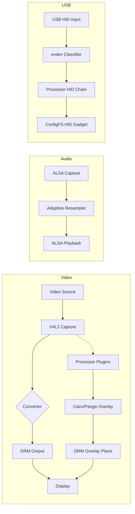

# OverlAIer

Real-time HDMI passthrough with pluggable video overlays and optional USB HID proxying.

OverlAIer captures video via V4L2, renders overlay primitives produced by processor plugins, and displays the composited result via DRM/KMS with low latency. Audio is passed through with adaptive resampling, and supported USB HID devices can be proxied through Linux USB gadget mode.

## Features

- Low-latency video passthrough with DMA-BUF sharing between V4L2 and DRM when formats line up
- Overlay compositing on a separate ARGB8888 DRM plane using Cairo + Pango
- Pluggable `.so` processors that analyze frames without blocking the video path
- Adaptive ALSA capture/playback with clock-drift compensation via libsamplerate
- Automatic EDID passthrough generation to steer the upstream HDMI source
- Automatic backend selection for format conversion, with optional Rockchip RGA acceleration
- Device discovery via `query`, including V4L2, DRM, ALSA, converter backends, and USB HID inputs
- Optional USB HID proxying through ConfigFS gadget mode for keyboard and mouse class devices

## Build

Requirements:

- Linux
- CMake 3.25+
- C23-capable compiler
- ALSA, libdrm, libyuv, libsamplerate, cairo, pangocairo, libdisplay-info
- Optional: `librga` for Rockchip hardware conversion

Build locally:

```bash
mkdir build
cd build
cmake .. -DCMAKE_BUILD_TYPE=Release
cmake --build . --target deploy
```

The `deploy` target copies the runtime layout to the repo-local `build/` directory:

```text
build/
├── overlAIer
├── overlAIer.toml
└── processors/
    └── fps_counter.so
```

Docker build:

```bash
docker buildx build --target artifacts --output type=local,dest=./dist .
```

Formatting and linting:

```bash
cmake --build build --target format
cmake --build build --target format-check
```

If `clang-tidy` is installed, it is enabled automatically on the main target during the build.

## Quick Start

Run with autodetection where possible:

```bash
./build/overlAIer \
  --video-out /dev/dri/card0:HDMI-A-2 \
  --res 1920x1080 \
  --fps 120
```

Inspect detected devices and available converter backends:

```bash
./build/overlAIer query
./build/overlAIer query --format json
```

Load a processor from config:

```toml
[[processor]]
path = "/absolute/path/to/fps_counter.so"
```

## CLI

```text
overlAIer [command] [options]

Commands:
  run          Start the overlay pipeline (default)
  query        Query device capabilities

Device options:
  --video-in,  -i DEV       V4L2 capture device
  --video-out, -o DEV[:CON] DRM device[:connector]
  --audio-in,  -a DEV       ALSA capture device
  --audio-out, -A DEV       ALSA playback device

Format options:
  --fmt                     Set input and output pixel format
  --res WxH                 Set input and output resolution
  --fps FPS                 Set input and output framerate
  --fmt-in,  -f FOURCC      Force V4L2 input format
  --fmt-out, -F FOURCC      Force DRM output format
  --res-in,  -r WxH         Force input resolution
  --fps-in,  -R FPS         Force input framerate
  --res-out, -s WxH         Force output resolution
  --fps-out, -S FPS         Force output framerate

Query options:
  --format, -O FORMAT       plain | json

USB proxy options:
  --usb-device VID:PID      Proxy a USB HID device (repeatable)

General:
  --config,    -C PATH      Config file
  --log-level, -L LEVEL     verbose|debug|info|warn|error|fatal|none
  --async-flip              Enable async DRM page flips
  --help,      -h           Show help
```

## Configuration

The program loads `overlAIer.toml` next to the executable by default. CLI flags override config values.

```toml
[device]
video_out = "/dev/dri/card0:HDMI-A-2"

[format]
res_out = "2560x1440"
fps_out = 120

[general]
log_level = "info"
async_flip = false

[[processor]]
path = "/absolute/path/to/fps_counter.so"

[usb]
udc = "fe800000.usb"

[[usb.device]]
vid_pid = "046d:c52b"
```

USB proxy notes:

- `query` lists candidate USB HID devices with `vid_pid`, evdev path, and inferred type.
- Proxying currently targets keyboard and mouse style HID devices through Linux ConfigFS gadget mode.
- This path needs a Linux system configured for USB device mode, plus permission to manage ConfigFS and access input devices.

## Processor Plugins

Processors are shared libraries loaded at runtime with `dlopen`. Each processor receives captured frames in its own worker thread and can optionally react to display flips or rewrite proxied HID reports.

Current interface:

```c
struct ovl_frame_info {
    uint32_t sequence;
    uint64_t timestamp_us;
    uint32_t width, height;
    uint32_t stride;
};

struct ovl_processor_def {
    const char *name;
    void *(*init)(const struct ovl_processor_def *def,
                  uint32_t width, uint32_t height,
                  enum ovl_pixfmt format);
    void (*on_frame)(void *state, const void *frame_data,
                     const struct ovl_frame_info *info,
                     struct ovl_primitive **prims_out, int *count_out);
    void (*on_flip)(void *state, const struct ovl_frame_info *info);
    int (*on_hid_report)(void *state, uint8_t *report, int *report_len,
                         const char *device_name, uint16_t vid, uint16_t pid);
    void (*destroy)(void *state);
};
```

The shared library must export:

```c
const struct ovl_processor_def *ovl_processor_register(void);
```

Video processors emit overlay primitives with normalized coordinates in `[0, 1]`. If `on_hid_report` is implemented, processors form a chain and can mutate or drop outgoing HID reports during USB proxying.

See `processors/fps_counter/` for the in-tree example.

## Architecture



Additional implementation detail and repo structure notes live in [AGENTS.md](AGENTS.md).

## License

Apache License 2.0. See [LICENSE](LICENSE).
