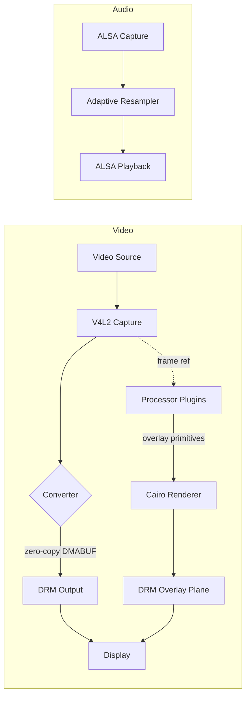

# OverlAIer

Real-time HDMI passthrough with pluggable overlay processing.

Captures HDMI video and audio via V4L2, passes it through to a display via DRM/KMS with minimal latency, and renders overlay graphics produced by processor plugins. Works on any Linux system with V4L2 capture and DRM output. Tested on Rock 5B Plus (RK3588).

## Features

- **Low-latency video passthrough** with zero-copy DMA buffers via V4L2 and DRM/KMS (sustained 1440p120 on Rock 5B Plus)
- **EDID management**: auto-generates passthrough EDID to control source resolution/fps
- **Pluggable processors**: `.so` plugins that analyze video frames and emit overlay primitives
- **Hardware overlay compositing**: overlays rendered on a separate DRM plane (no video path overhead)
- **Audio passthrough** with adaptive clock drift compensation via libsamplerate
- **Signal change resilience**: automatic reinit on signal changes, signal loss, or hot-plug
- **Auto-detection**: finds V4L2 capture, DRM output, and ALSA endpoints automatically
- **Optional RGA acceleration**: Rockchip RGA2/RGA3 hardware conversion when available, falls back to software (libyuv)

## Install

```bash
curl -fsSL https://raw.githubusercontent.com/manuel-alvarez-alvarez/overlAIer/master/installer/install.sh | sh
```

Installs to `~/.overlAIer/` with bundled shared libraries (no system dependencies needed). The pipeline binary needs root (USB gadget configfs, `/dev/hidg*`, `/dev/input/event*`), so the installer registers it as a systemd **system** service via `sudo`; the web UI stays a user service. A `.path` unit watches the config file and auto-restarts the pipeline on changes. Run the installer as your normal user — it will prompt for sudo when needed.

To update an existing installation, run the same command. To uninstall:

```bash
curl -fsSL https://raw.githubusercontent.com/manuel-alvarez-alvarez/overlAIer/master/installer/install.sh | sh -s -- --uninstall
```

## Quick Start

### Prerequisites

Linux aarch64 system with:
- V4L2 capture device (e.g. HDMI capture card, USB capture)
- DRM/KMS display output

### Build from source

```bash
# On the target device or via Docker
mkdir build && cd build
cmake .. -DCMAKE_BUILD_TYPE=Release
cmake --build . --target deploy
```

Or using Docker (aarch64):

```bash
docker buildx build --target artifacts --output type=local,dest=./dist .
```

### Run

```bash
# Auto-detect everything, 1080p120
./build/overlAIer --video-out /dev/dri/card0:HDMI-A-2 --res 1920x1080 --fps 120

# Specify all options
./build/overlAIer \
  --video-in /dev/video0 \
  --video-out /dev/dri/card0:HDMI-A-2 \
  --audio-in hw:2,0 \
  --audio-out hw:1,0 \
  --res 1920x1080 \
  --fps 120

# Query available devices
./build/overlAIer query --format json
```

### CLI Options

| Option | Description |
|--------|-------------|
| `--config PATH` | Config file (default: `overlAIer.toml` next to the binary) |
| `--res WxH` | Resolution for input and output |
| `--fps N` | Framerate for input and output |
| `--video-out DEV:CON` | DRM device and connector (e.g. `/dev/dri/card0:HDMI-A-2`) |
| `--log-level LEVEL` | `verbose`, `debug`, `info`, `warn`, `error`, `fatal`, `none` |
| `--async-flip` | Lower latency page flips (may tear) |

Use `--res-in`/`--res-out` and `--fps-in`/`--fps-out` to set input and output independently.

### Configuration

Settings can be defined in a TOML config file (`overlAIer.toml`). By default, the binary looks for it next to itself. CLI arguments always take precedence.

```toml
[device]
video_out = "/dev/dri/card0:HDMI-A-2"

[format]
res_out = "2560x1440"
fps_out = 120

[general]
log_level = "info"

[[processor]]
path = "/path/to/fps_counter.so"
```

When installed via the installer, the systemd service passes `--config ~/.overlAIer/overlAIer.toml` explicitly. A `.path` unit watches the config file and auto-restarts the service on changes.

## Writing a Processor Plugin

Processors are shared libraries (`.so`) that receive video frames and emit overlay primitives.

```c
#include "processor/processor.h"

static void *my_init(const struct ovl_processor_def *def,
                     uint32_t width, uint32_t height, enum ovl_pixfmt format) {
    // Allocate state
    return calloc(1, sizeof(struct my_state));
}

static void my_process(void *state, const void *frame_data,
                       uint32_t width, uint32_t height, uint32_t stride,
                       struct ovl_primitive **prims_out, int *count_out) {
    // Analyze frame, produce overlays
    static struct ovl_primitive prims[1];
    prims[0] = (struct ovl_primitive){
        .type = OVL_PRIM_TEXT,
        .fill = {1, 1, 1, 1},
        .text = {.x = 0.01, .y = 0.01, .text = "Hello", .font = "Sans", .size = 0.03},
    };
    *prims_out = prims;
    *count_out = 1;
}

static void my_destroy(void *state) { free(state); }

static const struct ovl_processor_def my_processor = {
    .name = "my-processor",
    .input = {.format = OVL_PIXFMT_UNKNOWN}, // same as capture
    .init = my_init,
    .process = my_process,
    .destroy = my_destroy,
};

const struct ovl_processor_def *ovl_processor_register(void) {
    return &my_processor;
}
```

Add it to `processors/CMakeLists.txt`:

```cmake
add_processor(my_processor my_processor/my_processor.c)
```

Coordinates are normalized [0, 1]. Available primitives: `RECT`, `CIRCLE`, `ELLIPSE`, `LINE`, `POLYLINE`, `POLYGON`, `ARC`, `BEZIER`, `TEXT`, `IMAGE`.

## Architecture



Converter is inserted only when V4L2 and DRM formats don't match. Processors run in separate threads and never block the video path.

See [AGENTS.md](AGENTS.md) for detailed architecture documentation.

## License

Licensed under the Apache License, Version 2.0. See [LICENSE](LICENSE) for details.
